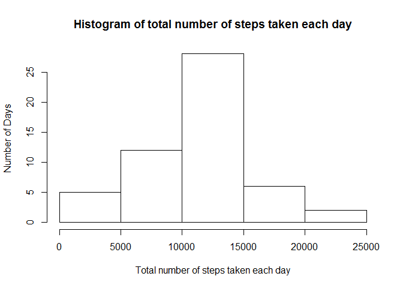
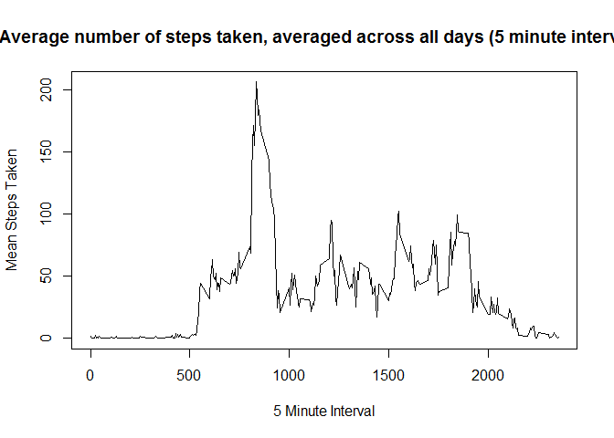
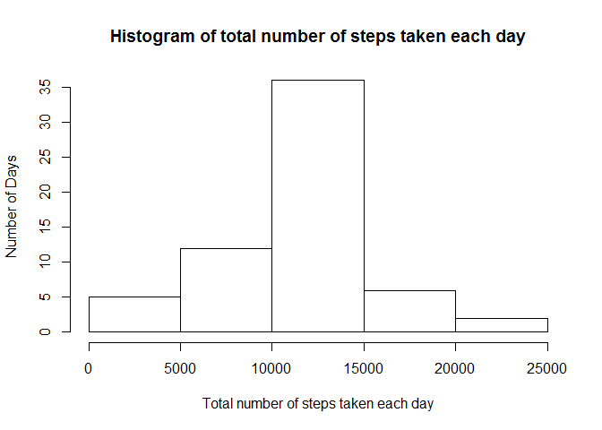
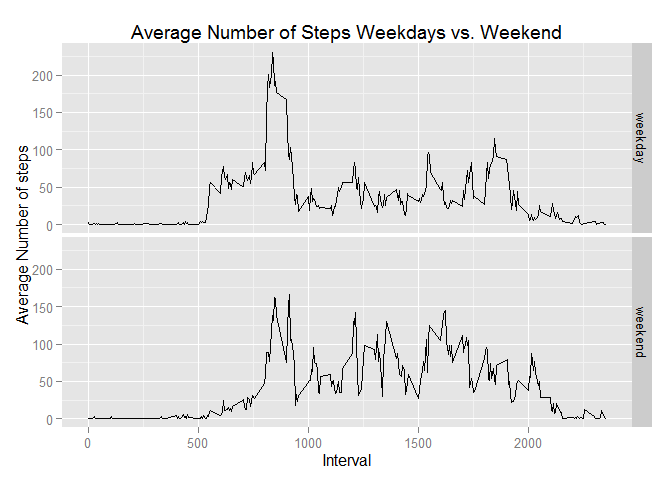

# Reproducible Research: Peer Assessment 1


## Loading and preprocessing the data
Unzip the data from the zip file, get a preview of the data.


```r
## Unzip the file
activityCSV <- unzip("activity.zip")

##Read the CSV
rawActivityData <- read.csv(activityCSV)

##Clear the original CSV file from memory, no longer needed.
rm(activityCSV)

##Preview Data
head(rawActivityData)
```

```
##   steps       date interval
## 1    NA 2012-10-01        0
## 2    NA 2012-10-01        5
## 3    NA 2012-10-01       10
## 4    NA 2012-10-01       15
## 5    NA 2012-10-01       20
## 6    NA 2012-10-01       25
```

Remove any NAs and change make sure the date column is in the date format


```r
##Remove any NAs

cleanedActivityData <- na.omit(rawActivityData)

##Change Date column to date format

cleanedActivityData$date <- as.Date(cleanedActivityData$date)
```


## What is mean total number of steps taken per day?

Load the dplyr package for easier coding and data manipulation then calculate the total number of steps taken per day.


```r
## Load the dplyr package
library(dplyr)
```

```
## Warning: package 'dplyr' was built under R version 3.1.3
```

```
## 
## Attaching package: 'dplyr'
## 
## The following object is masked from 'package:stats':
## 
##     filter
## 
## The following objects are masked from 'package:base':
## 
##     intersect, setdiff, setequal, union
```

```r
## Group data by date and sumarize

stepsPerDay <- cleanedActivityData %>%
  group_by(date) %>%
    summarize(StepSum = sum(steps))
```

Make a histogram of the total number of steps taken each day

```r
## Create historgram
hist(stepsPerDay$StepSum
  , xlab="Total number of steps taken each day"
  , ylab="Number of Days"
  , main="Histogram of total number of steps taken each day"
  )
```

 

Calculate and report the mean and median of the total number of steps taken per day.


```r
## Calculate Mean and Median
meanSteps <- mean(stepsPerDay$StepSum)
medianSteps <- median(stepsPerDay$StepSum)
```

### The mean steps taken per day was:

```
## [1] 10766.19
```

### The median steps taken per day was:  

```
## [1] 10765
```

## What is the average daily activity pattern?
Make a time series plot (i.e. type = "l") of the 5-minute interval (x-axis) and the average number of steps taken, averaged across all days (y-axis).


```r
## Group data by 5 miunte interval and take the mean
fiveMinuteIntervalMean <- cleanedActivityData %>%
    group_by(interval) %>%
    summarize(meanSteps=mean(steps))

## Create time series plot of the mean data
plot(fiveMinuteIntervalMean$interval, fiveMinuteIntervalMean$meanSteps
  , type="l"
  , xlab="5 Minute Interval"
  , ylab="Mean Steps Taken"
  , main="Average number of steps taken, averaged across all days (5 minute intervals)")
```

 

### Which 5-minute interval, on average across all the days in the dataset, contains the maximum number of steps?

```r
maxStepInterval <- fiveMinuteIntervalMean$interval[which.max(fiveMinuteIntervalMean$meanSteps)]

maxStepInterval
```

```
## [1] 835
```

## Imputing missing values
Calculate and report the total number of missing values in the dataset


```r
countNAs <- sum(is.na(rawActivityData$steps))

countNAs
```

```
## [1] 2304
```

Devise a strategy for filling in all of the missing values in the dataset. The strategy does not need to be sophisticated. For example, you could use the mean/median for that day, or the mean for that 5-minute interval, etc. Create a new dataset that is equal to the original dataset but with the missing data filled in.


```r
## Make a new dataset to be manipulated

filledData <- rawActivityData

## Convert date to date format

filledData$date <- as.Date(filledData$date)

## Replace all NAs with average for that five minute interval

filledData$steps <- ifelse(
  is.na(filledData$steps)
  , fiveMinuteIntervalMean$meanSteps[match(filledData$interval, fiveMinuteIntervalMean$interval)]
  , filledData$steps)

## Check to see if all NAs have been filled

countNAsFilled <- sum(is.na(filledData$steps))

countNAsFilled
```

```
## [1] 0
```

Make a histogram of the total number of steps taken each day.

```r
## Group data by date and sumarize

stepsPerDayFilled <- filledData %>%
  group_by(date) %>%
    summarize(StepSum = sum(steps))
    
## Create historgram
hist(stepsPerDayFilled$StepSum
  , xlab="Total number of steps taken each day"
  , ylab="Number of Days"
  , main="Histogram of total number of steps taken each day"
  )
```

 

Calculate and report the mean and median of the total number of steps taken per day.


```r
## Calculate Mean and Median
meanSteps <- mean(stepsPerDayFilled$StepSum)
medianSteps <- median(stepsPerDayFilled$StepSum)
```

### The mean steps taken per day was:

```
## [1] 10766.19
```

### The median steps taken per day was:  

```
## [1] 10766.19
```

Do these values differ from the estimates from the first part of the assignment? What is the impact of imputing missing data on the estimates of the total daily number of steps?

####The values differ from the estimates from the first part of the assignment. Due to imputing the missing values the mean has not changed but the median is slightly higher and is now equal to the mean total daily number of steps. 


## Are there differences in activity patterns between weekdays and weekends?

Create a new factor variable in the dataset with two levels – “weekday” and “weekend” indicating whether a given date is a weekday or weekend day.


```r
filledData$weekdayWeekend <- ifelse(
  is.element(weekdays(filledData$date), c('Saturday','Sunday'))
  , 'weekend'
  , 'weekday')
```

Make a panel plot containing a time series plot (i.e. type = "l") of the 5-minute interval (x-axis) and the average number of steps taken, averaged across all weekday days or weekend days (y-axis). 


```r
## Get the average number of steps taken across 5 minute intervals, averaged across weekdays or weekends
weekdayWeekendAverage <- filledData %>%
    group_by(weekdayWeekend, interval) %>%
    summarize(averageSteps=mean(steps))

## Load ggplot2 for easier plotting
library(ggplot2)
```

```
## Warning: package 'ggplot2' was built under R version 3.1.3
```

```r
qplot(interval
  , averageSteps
  , data=weekdayWeekendAverage
  , type="l"
  , geom="line"
  , xlab="Interval"
  , ylab="Average Number of steps"
  , main="Average Number of Steps Weekdays vs. Weekend"
  , facets = weekdayWeekend ~ .)
```

 

